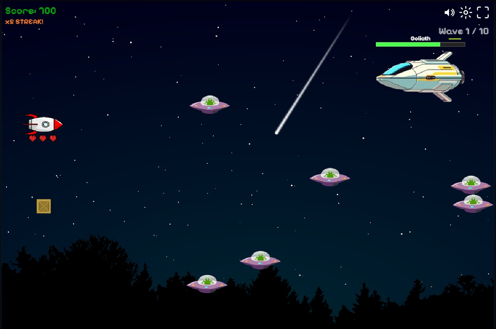

# Space Fight 2

A browser-based space shooter I built with vanilla JavaScript and the HTML5 Canvas API.
It has 10 waves with a boss in each one, runs in any browser, and needs no installation.

> Just open `index.html` and play.

---

## The Story

This project started from a [YouTube tutorial](https://youtu.be/eWLDAAMsD-c) that showed how to build a basic space shooter in JavaScript — a rocket that moves up and down, UFOs flying across the screen, and simple collision detection. After finishing it, I kept going instead of moving on.

I started adding things I wanted to see in the game: a wave system, bosses, a sound system, mobile controls, settings that save between sessions. Every feature brought new problems to solve and things to figure out. At some point it stopped feeling like following a tutorial and started feeling like building my own project.

The result is this — still a work in progress, but already a lot more than where it started.

> **Note on difficulty:** The bosses are balanced around the idea that the player would have an upgrade system — better weapons, more health, that kind of thing. That part is not built yet. Because of that, the later waves get very hard and some bosses can feel close to impossible to beat in the current state. That is something I am aware of and plan to fix once the upgrade system is in place.

---

## What the Game Has

- **10 waves**, each ending with a unique boss that has its own speed, health, fire rate, and size
- **UFO enemies** that spawn continuously and get faster and tougher with each wave
- **Boss behaviour** — each boss enters from the right, moves around, reloads between bursts, and tries to dodge your shots
- **Score system** with a kill-streak multiplier up to 5× for staying on the offensive
- **Powerups** — a health restore and a shot speed boost, dropped by enemies or appearing over time
- **3 lives** with a short invincibility window after taking damage
- **Sound system** with background music, shot, hit, and typing sounds — all individually adjustable in the settings
- **Settings and best score** saved automatically via `localStorage` so they carry over between sessions
- **Mobile support** with on-screen touch controls and a responsive layout
- **Typewriter HUD** that types out wave events and boss messages character by character

---

## Controls

| Input                 | Action                                            |
|-----------------------|---------------------------------------------------|
| `Arrow Up` / `W`      | Move up                                           |
| `Arrow Down` / `S`    | Move down                                         |
| `Space`               | Shoot                                             |
| `E`                   | Advance to the next wave after a boss is defeated |
| `Escape`              | Pause and return to menu                          |
| Mobile                | On-screen up, down, and fire buttons              |

---

## How to Run

1. Download or clone the repository
2. Open `index.html` in any modern browser (Chrome, Firefox, Edge, Safari)
3. Press **Start**

No server, no build step, no dependencies.

---

## Built With

- **HTML5 Canvas API** — all game rendering
- **Vanilla JavaScript (ES6+)** — game logic and structure
- **CSS3** — responsive layout, animations, custom slider styles
- **Web Audio API** — sound playback and volume control
- **localStorage** — saving settings and the best score between sessions

---

## What I Added Beyond the Tutorial

The tutorial covered the basics: player movement, UFO spawning, shooting, and collision detection. Everything below I built myself on top of that foundation:

- A **wave and boss system** — 10 bosses written as ES6 classes that all extend one shared base class
- **Boss behaviour** — entry animation, movement patterns, shot dodging, and a magazine and reload cycle
- A **kill-streak score multiplier**
- A **powerup system** with two types, timed effects, and proper state management
- A **sound system** with multiple audio channels, per-channel volume sliders, and a mute toggle
- A **settings menu** and **game over screen**
- **Mobile touch controls** and a fully responsive canvas layout
- A **typewriter event log** for in-game messages that can be paused and cancelled
- **Pause and resume** at any point during a run
- **localStorage** for persistent settings and scores

---

## What I Learned

This project taught me things I would not have gotten from just reading about them:

- How a **game loop** works in practice — keeping logic on a fixed-rate timer while rendering runs as fast as the screen allows
- How to use **ES6 class inheritance** in a real project — not just theory, but a base class shared by 10 different boss types
- How **collision detection** works and how to structure it cleanly across multiple systems
- How to manage **application state** — pausing, resuming, and resetting without things breaking
- How **browser audio** works — autoplay restrictions, cloning audio nodes, handling multiple channels
- How to design for **mobile browsers** — touch events, safe area insets, scaling a canvas to fit any screen
- Why **separating concerns** matters — keeping rendering, logic, input, and UI in separate places makes the code much easier to work with
